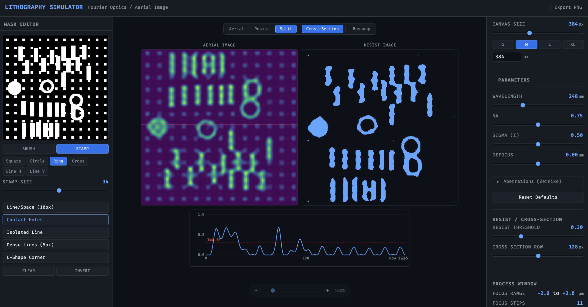

# Lithography Simulator

An interactive web-based optical lithography simulator built with TypeScript and WebGL2. Draw or select mask patterns and visualize the resulting aerial images in real time using Fourier optics.



## How It Works

The simulator models the optical imaging pipeline used in semiconductor lithography:

1. A binary **mask** is transformed to the frequency domain via 2D FFT
2. A **pupil filter** applies the lens aperture and defocus aberrations
3. An inverse FFT produces the aerial image amplitude
4. The squared magnitude gives the **intensity distribution** rendered as a heatmap

You can adjust optical parameters and immediately see how they affect the image — useful for building intuition around resolution limits, diffraction, and process windows.

## Features

- **Interactive mask editor** — freehand brush and geometric stamp tools (square, circle, ring, cross, line)
- **Preset patterns** — line/space, contact holes, isolated line, dense lines, L-shape corner
- **Real-time simulation** — custom radix-2 Cooley-Tukey FFT runs on every change
- **GPU-rendered heatmap** — WebGL2 with viridis colormap
- **Tunable parameters** — wavelength (193–365 nm), NA (0.1–1.4), partial coherence (0–1), defocus (-2 to +2 um)
- **Adjustable canvas size** — slider, presets, or direct input
- **Mobile support** — tab navigation and touch drawing
- **Performance readout** — simulation and render timing in ms

## Quick Start

Requires [Bun](https://bun.sh).

```bash
# Install dependencies
bun install

# Start dev server
bun run dev
```

Open [http://localhost:3000](http://localhost:3000).

### Production Build

```bash
bun run build
```

Outputs a minified bundle to `src/public/dist/`.

## Project Structure

```
src/
├── server.ts              # Bun HTTP server
├── app/
│   ├── main.ts            # Entry point
│   └── state.ts           # Observable state with rAF debouncing
├── simulation/
│   ├── pipeline.ts        # FFT → pupil filter → IFFT → intensity
│   ├── pupil.ts           # Circular aperture + defocus phase
│   ├── fft.ts             # Radix-2 Cooley-Tukey 2D FFT
│   └── mask-presets.ts    # Predefined mask patterns
├── rendering/
│   ├── renderer.ts        # WebGL2 heatmap renderer
│   ├── shaders.ts         # GLSL shaders
│   └── colormap.ts        # Viridis colormap (256 entries)
├── ui/
│   ├── layout.ts          # Responsive 3-panel / tab layout
│   ├── mask-editor.ts     # Canvas drawing tools
│   ├── sliders.ts         # Parameter controls
│   └── canvas-size.ts     # Display size controls
└── public/
    ├── index.html
    └── style.css
```

## Tech Stack

- **TypeScript** — strict mode, no frameworks
- **WebGL2** — GPU-accelerated rendering
- **Canvas 2D** — mask editor
- **Bun** — runtime, bundler, and dev server

## License

MIT
